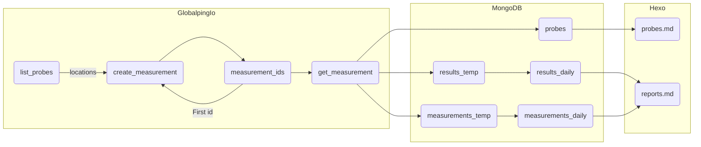

# Amia33/Globalping

Globalping Automation

## Status

|  Task   |         Started          |          Ended           |
| :-----: | :----------------------: | :----------------------: |
| Measure | 2024-07-31T08:18:43.642Z | 2024-07-31T08:19:17.018Z |
|  Daily  | 1970-01-01T00:00:00.000Z | 1970-01-01T00:00:00.000Z |
| Weekly  | 1970-01-01T00:00:00.000Z | 1970-01-01T00:00:00.000Z |
| Monthly | 1970-01-01T00:00:00.000Z | 1970-01-01T00:00:00.000Z |
| Yearly  | 1970-01-01T00:00:00.000Z | 1970-01-01T00:00:00.000Z |

## Workflow

