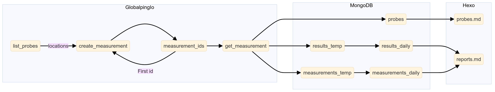

# Amia33/Globalping

Globalping Automation

## Status

  

|  Task   |         Started          |          Ended           |
| :-----: | :----------------------: | :----------------------: |
| Measure | 2024-08-09T21:29:39.375Z | 2024-08-09T21:30:06.874Z |
|  Daily  | 2024-08-09T06:35:02.036Z | 2024-08-09T06:35:27.536Z |
| Weekly  | 2024-08-05T06:39:43.835Z | 2024-08-05T06:39:51.351Z |
| Monthly | 1970-01-01T00:00:00.000Z | 1970-01-01T00:00:00.000Z |
| Yearly  | 1970-01-01T00:00:00.000Z | 1970-01-01T00:00:00.000Z |

## Workflow

